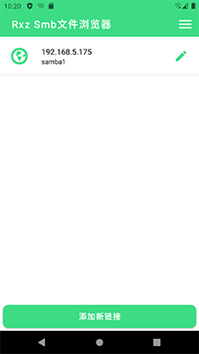
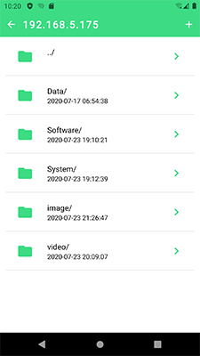
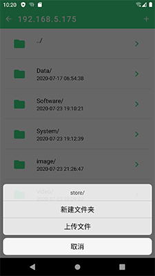

## samba Android客户端

Samba smb Android客户端 文件浏览器 CIFS ipv4/ipv6/域名

当前版本：v1.0.1

---

### 1. 介绍 

+ 支持IPV4/IPV6/域名访问samba服务器，界面简洁。
+ 支持文件浏览，创建、删除文件夹，上传、下载、删除文件


  

---
### 2. 进度

+ 2020.07.12  
    0.0.1 完成项目创建，初步布局
+ 2020.07.19  
    0.0.1 完成显示所有链接，添加新链接功能
+ 2020.07.20  
    0.0.1 完成编辑、删除链接
+ 2020.07.22  
    0.0.1 完成连接到网络目录，浏览文件
+ 2020.07.23  
    1.0.0 完成上传、下载，删除、创建目录等。发布第一个版本

---
### 3. License

```
 GNU GENERAL PUBLIC LICENSE

 Copyright (C) Ruixiaozi
 
 Everyone is permitted to copy and distribute verbatim copies
 of this license document, but changing it is not allowed.

```